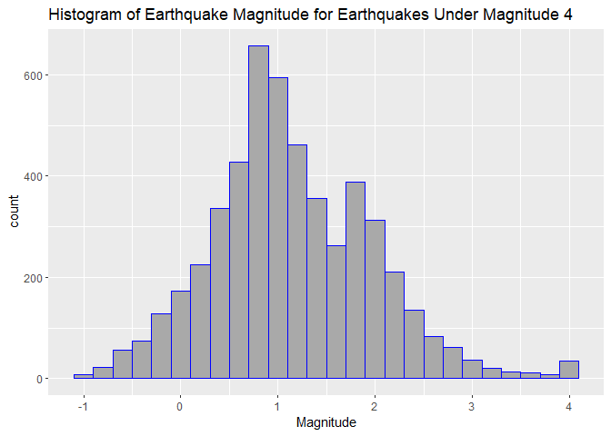
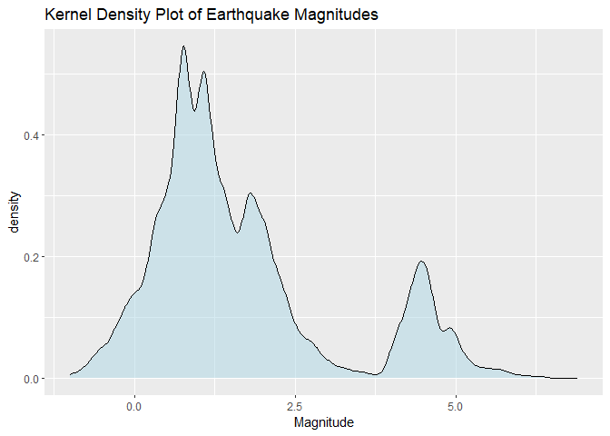
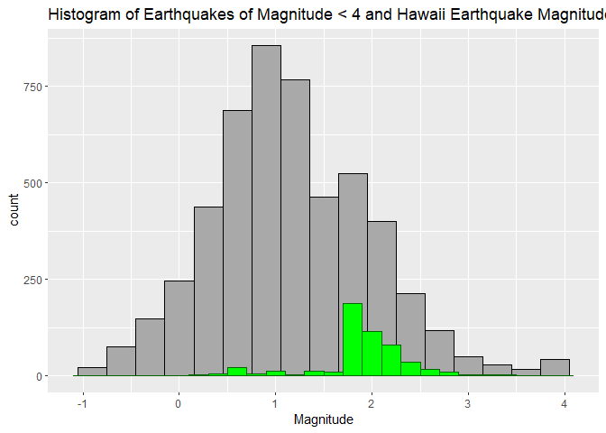
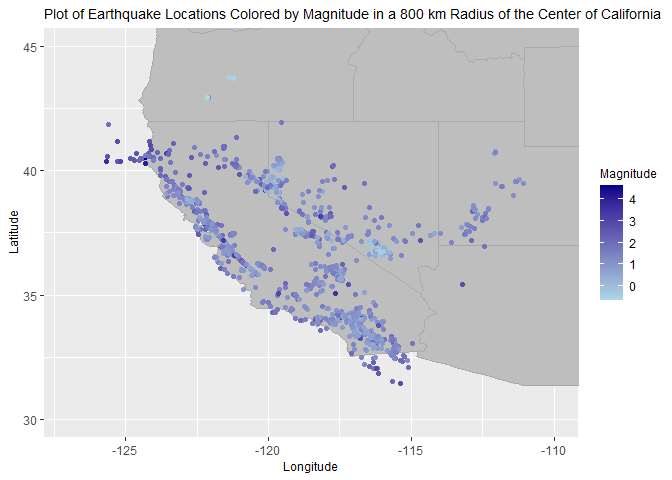
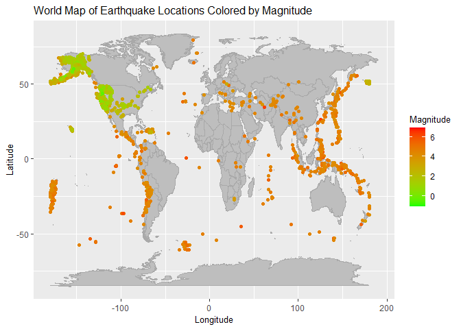

Interacting with the USGS Earthquake API
================
Rachel Fellman
2023-10-02

- [Required Packages](#required-packages)
- [Functions to Query Endpoints](#functions-to-query-endpoints)
  - [`eq.data`](#eqdata)
  - [`eq.location`](#eqlocation)
- [Data Exploration](#data-exploration)
- [Wrap Up](#wrap-up)

This document is intended to explain how to contact and API and query,
parse, and return readable data from an API. I will be accessing the
earthquake API from the USGS. I will start by building some functions to
access different endpoints of the API. This API can return data in a
variety of forms but for this example I will be specifying in the URL
that I want data in geoJSON format.

Since I am going to be retrieving data on earthquakes, I have developed
a few questions I’d like to investigate regarding earthquake magnitudes
and regions. *Do different regions have higher magnitude earthquakes
than others? *Are most earthquakes within a certain magnitude range?
*Are there different measurement methods that are more common for
measuring earthquake magnitude? *Are there observable patterns in the
earthquake data?

# Required Packages

I used the following packages to create the vignette: \* `jsonlite`: to
convert API data into a data frame \* `tidyverse`: used for piping,
plotting, and other basic functions \* `maps`: used to get longitude and
latitude data for creating maps

I first started by loading the necessary packages into rstudio.

``` r
library(tidyverse)
library(jsonlite)
library(maps)
```

# Functions to Query Endpoints

`var.name`

Before creating functions to query specific endpoints of the API, I will
create a function called `var.name` to rename certain variables, making
them easier to understand. The input for this function is a singular
`data.frame`.

``` r
var.name <- function(x){
  x <- rename(x, magnitude = mag, significance = sig, network = net, measurement.method = magType, station.distance = dmin, num.of.stations = nst, event.type = type)
}
```

## `eq.data`

The function `eq.data` interacts with the `minmagnitude`,
`maxmagnitude`, `maxgap`, and `eventtype` endpoints. It will allow the
user to chose a minimum and maximum magnitude, maximum gap, and event
type and will return a `tibble` containing the earthquake data.
Magnitude values can range from -1 to 10. The gap is the azimuthal gap
between stations. The smaller the gap, the more accurate the
calculations of the position of the earthquake are. This value can be
between 0.0 and 180.0 degrees. The event type will have a default value
of “earthquake” but can also take on other values such as “explosion”.

``` r
eq.data <- function(min.mag = 0, max.mag = 10, max.gap = 90.0, event.type = "earthquake"){
  #make the api url to query the endpoints specified in the function inputs
  my.url <- paste0("https://earthquake.usgs.gov/fdsnws/event/1/query?format=geojson",
                "&minmagnitude=", min.mag,
                "&maxmagnitude=", max.mag,
                "&maxgap=",max.gap,
                "&eventtype=", event.type)
  
  #get data from api using url created above
  quake.data <- fromJSON(my.url)
  
  #select specific columns
  quake.data.col<- quake.data$features$properties %>% 
    select('mag','place','time','sig','net','code','dmin','nst','rms','gap','magType','type') %>% 
    var.name()
  
  #return a tibble. of earthquake data
  return(as_tibble(quake.data.col))
}
```

## `eq.location`

The next function `eq.location` will interact once again with the
`eventtype` endpoint but will also include the `location` endpoint that
requires longitude, latitude, and radius to perform a circle search.
`eq.location` to will allow the user to specify a latitude, longitude
and maximum radius in km and will return data with those specifications
in the form of a `tibble`. The only default values will be the
`max.radius` set to 100 km and the `event.type` set to earthquake.
Latitude values can be from -90 to 90 degrees and longitude values can
span from -180 to 180 degrees. The maximum radius can be anywhere from 0
to 20001.6 km.

``` r
eq.location <- function(latitude, longitude, max.radius = 100, event.type = "earthquake"){
  #create URL for user specified depth
  my.url <- paste0("https://earthquake.usgs.gov/fdsnws/event/1/query?format=geojson",
                "&latitude=", latitude,
                "&longitude=", longitude,
                "&maxradiuskm=", max.radius,
                "&eventtype=", event.type)
  
  #get data from api with url created above
  quake.data <- fromJSON(my.url)
  
  #get longitude and latitude data from quake.data and convert it into a dataframe
  quake.loc <- as.data.frame(data.table::transpose(quake.data$features$geometry$coordinates), col.names = c("longitude","latitude","x"))
  
  #combine longitude and latitude data with other data
  quake.data.all <- cbind(quake.loc, quake.data$features$properties)
  
  #select specific columns .
  quake.data.col <- quake.data.all %>% 
    select('mag','place','time','sig','net','code','ids','dmin','nst','rms','gap','magType','type', 'longitude','latitude') %>% 
    var.name()
  
  #return a tibble of earthwuake data.
   return(as_tibble(quake.data.col))
}
```

# Data Exploration

Next I will pull data from some of the earthquake API endpoints and do
some exploratory data analysis.

I will pull data from the API using my `eq.data` function. I will set
the minimum magnitude to -1 and the maximum to 4, to look at smaller
earthquakes. (Magnitude is a measure of the size of an earthquake at its
source). I will set the maximum gap to 180 degrees since the USGS states
that earthquake locations with a gap larger than 180 degrees tend to
have larger location and depth uncertainties. I will not change the
settings for event type since I am primarily interested only in events
classified as earthquakes.

``` r
earthquakes.low <- eq.data(min.mag = -1, max.mag = 4, max.gap = 180)
earthquakes.low
```

    ## # A tibble: 5,097 × 12
    ##    magni…¹ place    time signi…² network code  stati…³ num.o…⁴    rms   gap measu…⁵
    ##      <dbl> <chr>   <dbl>   <int> <chr>   <chr>   <dbl>   <int>  <dbl> <dbl> <chr>  
    ##  1    1.35 14 k… 1.70e12      28 ci      4057…  0.0277      11 0.36     118 ml     
    ##  2    1.87 8 km… 1.70e12      54 hv      7360… NA           18 0.120    129 ml     
    ##  3    3    west… 1.70e12     139 tx      2023…  0           20 0.2       64 ml(tex…
    ##  4    2.29 14 k… 1.70e12      81 hv      7360… NA           41 0.130    173 ml     
    ##  5    0.82 9 km… 1.70e12      10 ci      4057…  0.0358      21 0.39     127 ml     
    ##  6    0.97 2 km… 1.70e12      14 ci      4057…  0.0609      18 0.26      66 ml     
    ##  7    1.92 10 k… 1.70e12      57 ci      4057…  0.0443      46 0.23      53 ml     
    ##  8    0.66 7 km… 1.70e12       7 nc      7394…  0.0118      11 0.01      53 md     
    ##  9    1.82 12 k… 1.70e12      51 hv      7360… NA           35 0.0900   177 md     
    ## 10    1.74 43 k… 1.70e12      47 ci      4057…  0.0690      11 0.2       77 ml     
    ## # … with 5,087 more rows, 1 more variable: event.type <chr>, and abbreviated
    ## #   variable names ¹​magnitude, ²​significance, ³​station.distance, ⁴​num.of.stations,
    ## #   ⁵​measurement.method

I will again pull data from the API using the `eq.data` function but
changing the magnitude settings to be between 4 and 10. All other inputs
will remain the same as above.

``` r
earthquakes.high <- eq.data(min.mag = 4, max.mag = 10, max.gap = 180)
earthquakes.high
```

    ## # A tibble: 881 × 12
    ##    magnit…¹ place    time signi…² network code  stati…³ num.o…⁴   rms   gap measu…⁵
    ##       <dbl> <chr>   <dbl>   <int> <chr>   <chr>   <dbl>   <int> <dbl> <dbl> <chr>  
    ##  1      5   15 k… 1.70e12     434 us      6000…   1.71      160  0.8     16 mww    
    ##  2      4.8 Chag… 1.70e12     354 us      6000…   3.78       48  1.3    112 mb     
    ##  3      4.3 196 … 1.70e12     284 us      6000…   2.41       26  1.13   116 mb     
    ##  4      4.1 5 km… 1.70e12     259 us      6000…   0.661      25  0.71   111 mb     
    ##  5      4   5 km… 1.70e12     253 tx      2023…   0.1        30  0.3     92 ml(tex…
    ##  6      5.1 37 k… 1.70e12     401 us      6000…   5.78      114  0.9     88 mww    
    ##  7      4.1 Juju… 1.70e12     259 us      6000…   1.40       21  0.27   134 ml     
    ##  8      4.4 198 … 1.70e12     298 us      6000…   2.49       24  0.78    81 mb     
    ##  9      4.8 203 … 1.70e12     354 us      6000…   2.53       55  0.78    75 mb     
    ## 10      4.7 30 k… 1.70e12     341 us      6000…   5.80       74  0.63   150 mb     
    ## # … with 871 more rows, 1 more variable: event.type <chr>, and abbreviated
    ## #   variable names ¹​magnitude, ²​significance, ³​station.distance, ⁴​num.of.stations,
    ## #   ⁵​measurement.method

I will also pull data for all earthquakes magnitude -1 to 10.

``` r
earthquakes.all <- eq.data(min.mag = -1, max.mag = 10, max.gap = 180)
```

Next I will examine the data pulled from the API with my functions.
Using `earthquakes.low` and `earthquakes.high`, I will create
contingency tables for `measurement.method` and `network`.
`measurement.method` tells us the method used to calculate the magnitude
for the event. This is of interest because different methods could
produce different results. The `network` variable provides the ID for
the network that is the main source of information for a given
earthquake. The networks include places such as AK: ALaska Earthquake
Center, HV: Hawaii Vocano Observatory, etc. The reason I am creating a 2
way table with `measurement.method` and `network` is to see if different
networks use a certain method more.

``` r
table(earthquakes.low$measurement.method, earthquakes.low$network)
```

    ##             
    ##                av   ci   hv   mb   nc   nm   nn   ok   pr   se   tx   us   uu   uw
    ##   mb            0    0    0    0    0    0    0    0    0    0    0   38    0    0
    ##   mb_lg         0    0    0    0    0    0    0    0    0    0    0    8    0    0
    ##   md            0    0  233    0 1627   31    0    0   50    6    0    0   93    7
    ##   mh            0    0    0    0    1    0    0    0    0    0    0    0    0    1
    ##   ml          509  922  237  163   10    0  282  198    0    0   78   50   93  288
    ##   ml(texnet)    0    0    0    0    0    0    0    0    0    0  166    0    0    0
    ##   mlv           0    0    0    0    0    0    0    0    0    0    1    0    0    0
    ##   mw            0    0    0    0    4    0    0    0    0    0    0    0    0    0
    ##   mwr           0    0    0    0    0    0    0    0    0    0    0    1    0    0

When looking at the lower magnitude earthquakes it seems like the ml
method is used most frequently. The ml method is the original magnitude
scale defined Richter and Gutenberg. It makes sense that this is a
commonly used method by many stations for low magnitude earthquakes
since the ml scale is most accurate for earthquakes with a magnitude
less than 4. The nc network (California Integrated Seismic Network:
Northern California) also has a high frequency for the md method. This
method is also useful for lower magnitude earthquakes and is sometimes
the only available method for very small seismic events.

To better visualize this I will create a bar plot of the `network` and
`measurement.method` for the lower magnitude data. Since the most used
measurement methods for low magnitude earthquakes are md and ml I will
first filter to include only those methods. This will just give us a
better visualization of which networks use which methods more
frequently.

``` r
#filter measurement.method variable
method.earthquake.low <- earthquakes.low %>% 
  filter(measurement.method == "md" | measurement.method == "ml")

#create base plot
g<- ggplot(data = method.earthquake.low, aes(x=measurement.method))
#add bar plot with net as the factor
g.plot<- g + geom_bar(aes(fill = as.factor(network)), position = "dodge") +
#add labels/ titles
  labs(x = "Measurement Method", title = "Magnitude Measurement Methods Across Networks for Earthquakes Under Magnitude 4") + 
  scale_fill_discrete(name= "Network", labels = c("Alaska Volcano Observatory", "California Integrated Seismic Network: Southern California", "Hawaii Volcano Observatory", "Montana Bureau of Mines and Geology", "California Integrated Seismic Network: Northern Californa", "New Madrid Seismic Network","Oklahoma Seismic Network", "Puerto Rico Seismic Network","Center for Earthquake Research and Information", "USGS National Earthquake Information Center","Texas Seismological Network", "University of Utah Seismograph Stations", "Pacific Northwest Seismic Network")) +
#adjust plot sizing
  theme(legend.title = element_text(size=7), legend.text = element_text(size=6), title = element_text(size = 10), plot.margin = margin(.1,.1,.1,.1,"cm"))
#display plot
g.plot
```

<!-- -->

From this bar graph it is easy to see that the California Integrated
Seismic network in both Northern and Southern California collect a large
amount of earthquake data. However, the md method is used most commonly
by the Northern California network and the ml method by the Southern
California network. This may be due to the typical magnitude of the
earthquakes found in each region.

Looking at the high magnitude earthquakes, I will create the same
contingency table as above with `measurement.method` and `network`

``` r
table(earthquakes.high$measurement.method, earthquakes.high$network)
```

    ##             
    ##               at  nc  tx  us  uw
    ##   mb           0   0   0 744   0
    ##   Mb           1   0   0   0   0
    ##   ml           0   0   1   3   1
    ##   Ml           1   0   0   0   0
    ##   ml(texnet)   0   0   1   0   0
    ##   mw           0   3   0   0   0
    ##   mwr          0   0   0  26   0
    ##   mww          0   0   0 100   0

My first observation is that there are fewer networks that measure high
magnitude earthquakes. This may be because there are fewer occurrences
of high magnitude earthquakes. The most commonly used method by the us
network (USGS National Earthquake Information Center) is the mb method.
This makes sense since the mb method is useful for earthquakes of
magnitude 4 to 6.5.

After examining the measurement methods, I am interested to look at the
average, median, and standard deviation low magnitude and high magnitude
earthquakes measured by each network. The reason I am including both the
median and mean is to account for outliers that could effect the
average. I will be grouping by `network` to see if the earthquake
magnitudes differ between them.

``` r
earthquakes.low %>% 
  group_by(network) %>% 
  summarize(min = min(magnitude), max = max(magnitude), avg = mean(magnitude), med = median(magnitude), sd= sd(magnitude))
```

    ## # A tibble: 14 × 6
    ##    network    min   max    avg   med    sd
    ##    <chr>    <dbl> <dbl>  <dbl> <dbl> <dbl>
    ##  1 av      -1      2.24 0.0866 0.04  0.546
    ##  2 ci      -0.11   3.52 1.11   1.04  0.502
    ##  3 hv       0.130  3.53 1.88   1.9   0.506
    ##  4 mb       0.17   2.62 1.27   1.21  0.543
    ##  5 nc      -0.42   3.97 1.06   1.02  0.596
    ##  6 nm       1.18   2.94 1.86   1.78  0.449
    ##  7 nn      -0.5    3.3  0.850  0.9   0.740
    ##  8 ok       0.41   3.68 1.56   1.48  0.534
    ##  9 pr       1.71   3.38 2.50   2.47  0.356
    ## 10 se       1.68   2.38 2.05   2.06  0.251
    ## 11 tx       1.6    4    2.30   2.2   0.426
    ## 12 us       1.5    4    3.24   3.4   0.735
    ## 13 uu      -0.8    2.75 0.928  0.98  0.677
    ## 14 uw      -0.61   2.76 0.683  0.575 0.626

The highest average earthquake magnitudes had data collected by the
Puerto Rico Seismic Network (pr) and the Center for Earthquake Research
and Information (SE). I didn’t know that Puerto Rico was a location that
had larger earthquakes so this is a surprise to me. Perhaps Puerto Rico
would be a good location to focus on in future studies.

Next I will create a histogram of the magnitude for the lower magnitude
earthquakes. I am interested in the distribution of the earthquakes and
if it is skewed in any direction.

``` r
#create base plot
a <- ggplot(data= earthquakes.low, aes(x = magnitude))
#add histogram
a.plot<- a + geom_histogram(color = "blue",fill = "darkgrey", size = .6, binwidth = .2, weight = 2) +
#add labels
  labs(x = "Magnitude", title = "Histogram of Earthquake Magnitude for Earthquakes Under Magnitude 4")
```

    ## Warning in geom_histogram(color = "blue", fill = "darkgrey", size = 0.6, : Ignoring
    ## unknown parameters: `weight`

``` r
#display plot
a.plot
```

<!-- -->

The lower magnitude earthquakes appear to be fairly normally distributed
with most earthquakes centering around a magnitude of 1.

I also curious if the data as a whole (not split into low and high
magnitude) also has a normal distribution. I will use `geom_density` to
look at the spread of the data.

``` r
#create base plot
b<- ggplot(earthquakes.all)
#add layer
b.plot<- b + geom_density(aes(x= magnitude), adjust = .5, alpha = .5, fill = "lightblue") +
#add labels/titles
  labs(x = "Magnitude", title= "Kernel Density Plot of Earthquake Magnitudes")
#display plot
b.plot
```

<!-- -->

When looking at the data as whole, it appears to be right skewed,
meaning that the majority of earthquakes are smaller/have a lower
magnitude. However we can see that there are also quite a few
earthquakes that measure around a magnitude of 4.5, as the density plot
displays a local maximum there.

Next I will find measures of center and spread for the high magnitude
earthquakes.

``` r
earthquakes.high %>% 
  group_by(network) %>% 
  summarize(min = min(magnitude), max = max(magnitude), avg = mean(magnitude), med = median(magnitude), sd= sd(magnitude))
```

    ## # A tibble: 5 × 6
    ##   network   min   max   avg   med     sd
    ##   <chr>   <dbl> <dbl> <dbl> <dbl>  <dbl>
    ## 1 at       4.3   5     4.65  4.65  0.495
    ## 2 nc       4.09  4.65  4.42  4.53  0.295
    ## 3 tx       4     4     4     4     0    
    ## 4 us       4     6.9   4.63  4.5   0.444
    ## 5 uw       4.32  4.32  4.32  4.32 NA

The maximum earthquake measured was a magnitude 6.9 much higher than the
averages for all networks which stay between 4 and 5.

I am curious where the 6.9 magnitude earthquake was so instead of just
summarizing I will use the `filter` function and explore further.

``` r
earthquakes.high %>% 
  filter(magnitude == 6.9)
```

    ## # A tibble: 1 × 12
    ##   magnitude place    time signi…¹ network code  stati…² num.o…³   rms   gap measu…⁴
    ##       <dbl> <chr>   <dbl>   <int> <chr>   <chr>   <dbl>   <int> <dbl> <dbl> <chr>  
    ## 1       6.9 55 k… 1.70e12     732 us      6000…    6.09     133  0.88    17 mww    
    ## # … with 1 more variable: event.type <chr>, and abbreviated variable names
    ## #   ¹​significance, ²​station.distance, ³​num.of.stations, ⁴​measurement.method

The highest magnitude earthquake in the data we pulled from the API was
in Madang, Papua New Guinea.

Instead of just looking at high and low magnitude earthquake data, I
will use my function`eq.location` to examine earthquakes in Hawaii. I
will specify the latitude 19.74 and longitude -155.84. This is the
latitude and longitude for Hawaii. I will increase the maximum radius to
200km. I am choosing Hawaii for this function since it is a location in
the U.S. known for having a lot of seismic activity.

``` r
eq.Hawaii <- eq.location(latitude = 19.74, longitude = -155.84, max.radius = 200)
eq.Hawaii
```

    ## # A tibble: 527 × 15
    ##    magnitude place    time signi…¹ network code  ids   stati…² num.o…³    rms   gap
    ##        <dbl> <chr>   <dbl>   <int> <chr>   <chr> <chr>   <dbl>   <int>  <dbl> <int>
    ##  1      1.87 8 km… 1.70e12      54 hv      7360… ,hv7…      NA      18 0.120    129
    ##  2      2.29 14 k… 1.70e12      81 hv      7360… ,hv7…      NA      41 0.130    173
    ##  3      1.82 12 k… 1.70e12      51 hv      7360… ,hv7…      NA      35 0.0900   177
    ##  4      1.73 <NA>  1.70e12      46 hv      7360… ,hv7…      NA      13 0.210    169
    ##  5      2.13 9 km… 1.70e12      70 hv      7360… ,hv7…      NA      16 0.11     110
    ##  6      2.14 7 km… 1.70e12      70 hv      7360… ,hv7…      NA      33 0.270     93
    ##  7      2.03 4 km… 1.70e12      63 hv      7360… ,hv7…      NA      46 0.120    158
    ##  8      1.84 11 k… 1.70e12      52 hv      7360… ,hv7…      NA       9 0.340    221
    ##  9      1.86 <NA>  1.70e12      53 hv      7360… ,hv7…      NA      34 0.130    106
    ## 10      1.92 <NA>  1.70e12      57 hv      7360… ,hv7…      NA      34 0.120     98
    ## # … with 517 more rows, 4 more variables: measurement.method <chr>,
    ## #   event.type <chr>, longitude <dbl>, latitude <dbl>, and abbreviated variable
    ## #   names ¹​significance, ²​station.distance, ³​num.of.stations

Next I want to look at measures of center and spread for the magnitude
of earthquakes in Hawaii across the `measurement.method` variable.

``` r
eq.Hawaii %>% 
  group_by(measurement.method) %>% 
  summarize(min = min(magnitude), max = max(magnitude), avg = mean(magnitude), med = mean(magnitude), sd = sd(magnitude))
```

    ## # A tibble: 2 × 6
    ##   measurement.method   min   max   avg   med    sd
    ##   <chr>              <dbl> <dbl> <dbl> <dbl> <dbl>
    ## 1 md                 0.130  2.64  1.69  1.69 0.508
    ## 2 ml                 1      3.53  2.11  2.11 0.380

This shows that the minimum magnitude earthquake measuring .13 was
measured using the md method while the smallest earthquake measured
using the ml method was a magnitude 1. This makes sense since the md
method is better for measuring very small events.

I am also curious about the distribution of the Hawaii earthquake
magnitudes in comparison to all smaller earthquakes. I will create a
histogram of the Hawaii data (colored in green) layered over all of the
smaller (magnitude \< 4) earthquake data to see if they follow a similar
distributions. The reason I am using the low magnitude data is because
the maximum magnitude for Hawaii earthquakes was 3.53.

``` r
#create base plot
a <- ggplot(data= earthquakes.low, aes(x = magnitude))
#add histogram
a.plot<- a + geom_histogram(fill = "darkgrey", binwidth = .3, color = "black") +
#add labels
  geom_histogram(data = eq.Hawaii, aes(x = magnitude), color =  "darkgreen",fill = "green", binwidth = .2)+
  labs(x = "Magnitude", title = "Histogram of Earthquakes of Magnitude < 4 and Hawaii Earthquake Magnitudes")
#display plot
a.plot
```

<!-- --> In this
histogram we can see that Hawaii’s earthquake data is skewed a bit to
the left with many earthquakes closer to a magnitude of 2. This does not
follow the same trend as data on all smaller earthquakes that in which
the majority of earthquakes are around a magnitude of 1. I am not too
surprised by this finding since Hawaii has active volcanoes which can
lead to high amounts of seismic activity.

The Hawaii data was interesting, but I’m also wanting to explore data in
some other locations. I will next examine California, another state
known for its earthquakes.

I will use `ggplot` with `geom_polygon` to make a map of some of the
earthquake data. I will start by using my `eq.location` function to get
data from the API in an 800km radius around the center of California. I
will then plot the points on a base map of the United States and color
the points on a color gradient with green being the lowest magnitude
earthquakes and red being the highest.

``` r
#call data from API
eq.california <- eq.location(latitude = 36.77, longitude = -119.42, max.radius = 800)
```

``` r
#set up state data points
state<- map_data("state")

#create base map layer
d<- ggplot()
#add latitude and longitude information for the map
d.plot<- d + geom_polygon(data = state, aes(x=long, y= lat, group = group), color = "darkgrey", fill = "grey") +
#add the points of the earthquakes in California
   geom_point(data = eq.california, aes(x = longitude, y = latitude, colour = magnitude))  +
#add a color gradient for the magnitude of the earthquakes
   scale_colour_gradient(low = "lightblue", high = "darkblue", name = "Magnitude")+
#adjust the coordinates
  coord_cartesian(xlim = c(-127,-110), ylim = c(30,45)) +
#add labels.
  labs(x = "Longitude", y = "Latitude", title = "Plot of Earthquake Locations Colored by Magnitude in a 800 km Radius of the Center of California") +
   theme(title = element_text(size=9))
#display plot
d.plot
```

<!-- -->

The interesting thing about this plot is that we can actually see the
San Andreas Fault that follows the California Coast. The majority of the
earthquakes seem to be in the 1 to 3 magnitude range, but there are a
few larger earthquakes along the coast of Northern California.

Since the California map provided a useful visual, I will also plot the
earthquake data for the entire globe. The points will once again be
colored by magnitude. First I will call data from the API using the
`eq.location` function with the latitude and longitude both set to 0 and
the maximum radius at its maximum allowed value.

``` r
#call data from API
eq.world <- eq.location(latitude = 0, longitude = 0 , max.radius = 20001.6)
```

``` r
#set up global data points
world<- map_data("world")

#create base map layer
e<- ggplot()
#add latitude and longitude information for the map
e.plot<- e + geom_polygon(data = world, aes(x=long, y= lat, group = group), color = "darkgrey", fill = "grey") +
#add the points of the earthquakes in california
   geom_point(data = eq.world, aes(x = longitude, y = latitude, color = magnitude))  +
#add a color gradient for the magnitude of the earthquakes
   scale_colour_gradient(low = "green", high = "red", name = "Magnitude")+
#add labels.
  labs(x = "Longitude", y = "Latitude", title = "World Map of Earthquake Locations Colored by Magnitude") +
   theme(title = element_text(size=10))
# display plot
e.plot
```

<!-- --> Just like
how we could visualize the San Andreas Fault in the California Map, we
can see the Ring of Fire in the World Map. Interestingly, it seems like
the United States has smaller earthquakes than the rest of the Globe.
U.S. earthquake magnitudes colored in yellows and greens range from 1 to
3 while most other earthquakes outside of the U.S. are colored in orange
indicating a magnitude of 3 to 5.

# Wrap Up

In this vignette, I created functions to query the earthquakes API and
interact with a couple different endpoints. I used the data I retrieved
to do some exploratory data analysis and found new information about
where high magnitude earthquakes tend to take place and which
measurement methods are more commonly used. Hopefully this vignette
helps users interact more easily with APIs.
